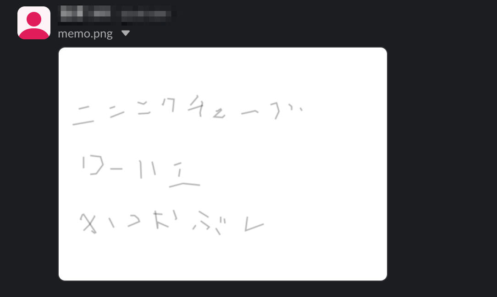

## Raspberry Pi Touch Screen Shopping List App

A simple yet powerful application that allows you to create handwritten shopping lists using a Raspberry Pi with touch screen and send them directly to Slack.

### Key Features

- **Touch Screen Drawing**: Create handwritten notes with an intuitive interface
- **Slack Integration**: Send your notes directly to a Slack channel
- **Clear Function**: Reset canvas with a single button press
- **Fullscreen Mode**: Maximize drawing area
- **Line Width Control**: Adjust drawing line thickness




### Tech Stack

- **Framework**: Dash (Plotly)
- **Language**: Python
- **External Service**: Slack API
- **Client**: Raspberry Pi with Touch Screen / Chromium Browser

### Setup

1. Install 

```bash
sudo install.sh
```
